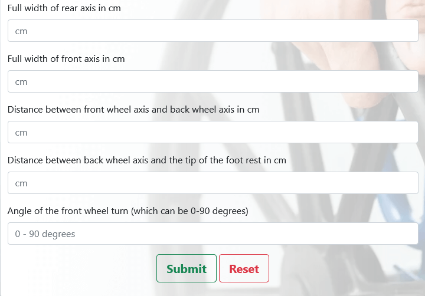
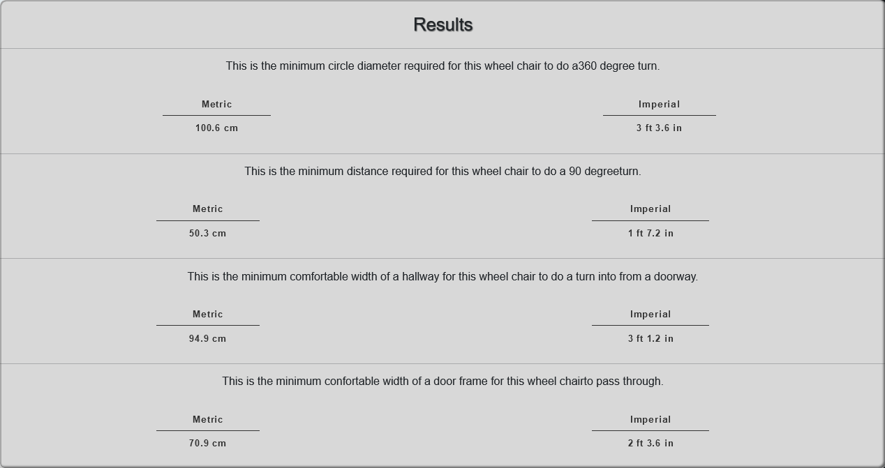

# Spinning Wheelchairs
+ Make sure your corridor is accessible! We offer a simple tool to help calculate accessibility for an electric-powered wheelchair with rear-wheel drive and direct steering. This tool will measure the comfortable distance needed for this type of wheelchair to make a turn from a doorway into a hallway at a constant angle. It will also tell a comfortable doorframe width for this type of chair to pass through.

 

Click [here](https://richardaeld.github.io/Hackathaon-trust-in-soda-team-2/) to live site.  


# Contents
[Spinning Wheelchairs](#spinning-wheelchairs)

[UX](#ux)
+ [User Stories](#user-stories)
+ [Wireframes](#wireframes)

[Existing Features](#existing-features)
+ [Navbar](#navbar)
+ [Home Page](#home-page)
+ [Results Page](#results-page)
+ [Contact Page](#contact-page)

[Future Features](#future-features)

[Technologies Used](#technologies-used)
+ [Languages Used](#languages-used)
+ [Frameworks, Libraries & Programs Used](#frameworks-libraries-and-programs-used)

[Code Validation](#code-validation)
+ [Automated Tests](#automated-tests)

[Project Bugs and Solutions](#project-bugs-and-solutions)

[Deployment](#deployment)
+ [Forking the GitHub Respository](#forking-the-github-repository)
+ [Making a Local Clone](#making-a-local-clone)

[Math](#math)
+ [Wheelchair types](#wheelchair-types)
+ [Formulas](#formulas)
  + [Finding Total Turning Diameter for BWDDS](#finding-total-turning-diameter-for-bwdds)
  + [Variables](#variables)
  + [Formula](#formaula)
+ [Finding Hallway Width](#finding-hallway-width)
  + [Assumptions](#assumptions)
  + [Variables](#variables)
  + [Formula](#formula)
+ [Finding Doorway Width](#finding-doorway-width)
  + [Assumptions](#assumptions)
  + [Variables](#variables)
  + [Formula](#formaula)

[Credits](#credits)
+ [Content](#content)
+ [Media](#media)

## UX

### User Stories

+ As a user, I would like to be able to …

1. Add my wheelchair's measures in centimetres;
2. Get the minimum corridor and door width that fits my wheelchair; 
3. Get my results in centimetres and imperial. 

+ As a site owner, I want…

1.  the information to be clear and informative;
2.  the website be easy to navigate;
3.  provide results in metric and imperial for the user;
3.  the information could help to design accessible wheelchair corridors;

### Wireframes 

Wireframes created with Balsamiq. The project was developed from initial wireframes and some modifications were made during the development process to assure better usability. 

[Wireframes](static/assets/readme/wireframes/index-page.png)

## Existing Features 

### Navbar 

+ Fixed Navbar with Home and Contact Us buttons to allow the user easy access to all pages. 
+ Collapsed navbar on smaller devices to wrap in all options and assure better navbar design.

### Home page 

+ Jumbotron to catch the user's attention for the app main goal. 

 

+ Shortly app instruction to assure that user can use it without doubts and easily. 

 

+ Form to allow the user to add their wheelchair measures. 

 

### Results Page 

+ The results page provides a list of measures (in meters and imperial) accordingly to the user's wheelchair inputs. The list is described below:

   + Minimum circle diameter required to do a 360-degree turn;
   + Minimum distance required to do a 90-degree turn;
   + Minimum comfortable width of a hallway to do a turn into from a doorway;
   + Minimum comfortable width of a door frame to pass through.

 

### Contact Page

+ Contact of all project collaborators (LinkedIn and GitHub).

 

## Future Features 

1. Add drop down box containing different wheelchair brands and types that would fill in the form with all necesary data for the known popular wheelchairs
2. Add drop down box to enable different calculations for wheelchairs with different turn - front wheels turning or rear wheels turning or differential steering
3. Analysing door opening - back - front ways or sliding door, which would be most suitable
4. Calculations for coridor width enabling 3 point turn
5. Enable user to choose input imperial or metric measures
6. Analysing small spaces - like bathrooms to make sure there is enough space for wheelchair and opening the door. 

## Technologies Used

### Languages Used

   + HTML5
   + CSS3
   + JavaScript

 ### Frameworks Libraries and Programs Used

+ Balsamiq:
    Balsamiq was used to create the wireframes during the design process.
+ Bootstrap 5:
    Bootstrap was used to add style to the website.
+ Git
    Git was used for version control by utilizing the Gitpod terminal to commit to Git and Push to GitHub.
+ GitHub:
    GitHub is used to store the project's code after being pushed from Git.


## Code Validation

### Automated tests

+ HTML

  Passing the HTML from all templates and base into the W3C Markup Validator no errors or warnings have been found [W3C validator](https://validator.w3.org/).

HTML validation results can be viewed on links:

| Pages  |  
| ------------------- | 
|  [Index](static/assets/readme/validation/index-validation.png) |  
|  [Results](static/assets/readme/validation/results-validation.png)|
|  [Contact](static/assets/readme/validation/contact-validation.png) |

+ CSS

No errors were found when passing through the official [W3C validator](https://jigsaw.w3.org/css-validator/). 
        
[Css](static/assets/readme/validation/css-validation.png)
+ JavaScript

Javascript files were tested with the jshint and no errors were been found. 

## Project Bugs and Solutions:


## Deployment

 The site was deployed to GitHub pages. 
 
 * The steps to deploy are as follows: 

  - In the GitHub repository, navigate to the Settings tab; 
  - From the source section drop-down menu, select the Master Branch;
  - Once the master branch has been selected, the page will be automatically refreshed with a detailed ribbon display to indicate the successful deployment. 

The live link can be found [here](https://richardaeld.github.io/Hackathaon-trust-in-soda-team-2/).

### Forking the GitHub Repository

By forking the GitHub Repository you will be able to make a copy of the original repository on your own GitHub account allowing you to view and/or make changes without affecting the original repository by using the following steps:

1. Log in to GitHub and locate the [GitHub Repository](https://github.com/Richardaeld/Hackathaon-trust-in-soda-team-2)
2. At the top of the Repository (not top of page) just above the "Settings" button on the menu, locate the "Fork" button.
3. You should now have a copy of the original repository in your GitHub account.

### Making a Local Clone

1. Log in to GitHub and locate the [GitHub Repository](https://github.com/Richardaeld/Hackathaon-trust-in-soda-team-2)
2. Under the repository name, click "Clone or download".
3. To clone the repository using HTTPS, under "Clone with HTTPS", copy the link.
4. Open Git Bash
5. Change the current working directory to the location where you want the cloned directory to be made.
6. Type `git clone`, and then paste the URL you copied in Step 3.

```
$ git clone https://github.com/Richardaeld/Hackathaon-trust-in-soda-team-2
```

7. Press Enter. Your local clone will be created.

## Math
### Wheelchair types
The scope of this project was limited to a single type of wheelchair. This wheelchair is an electrically powered, back wheel driven chair with direct steering. This was choosen because of its perceived popularity in the market. The formulas used in this project were found at the [Working Area of Wheelchairs.](https://www.udeworld.com/spaceworkshop2003/Papers/WEB%20-%20Working%20Area%20of%20%20Wheelchairs%20(Ziegler).htm)

### Formulas
#### Finding Total Turning Diameter for BWDDS
This method is used to find the total turning diameter for an electrically powered, back wheel driven wheelchair with direct steering.

##### Variables
+ y = Width between the chair's center of back axis and a back wheel.
+ h = Width between the chair's center of back axis and front wheel.
+ g = Width between front and back axis.
+ $\alpha$ = Angle of front wheel's turn.
+ x = Width between front most part of chair (tip of foot rest) to center of back axis.

##### Formaula
TD = 2 * $\sqrt{y + h + (g/sin(\alpha))^2 + x^2}$

#### Finding Hallway Width
##### Assumptions
+ The Wheelchair will start its turn in the center of a door way.
+ The ideal turn angle is instantly achieved and does not change.
+ Wheelchair will be able to make a single turn into hallway without having to backup.
+ The thickness of a back wheel of a BWDDS (back wheel driven wheelchair with direct steering) wheelchair is 3 inches.
+ A comfortable area of 'breathing space' is roughly 3.5 inch radius around someone.
+ An ideal hallway width is y + TD/2 + halfWheelThickness + comfortPadding.
  + This completes a 1/4 of the turn diameters circle.
  + Adds half of the back axis, half of a back wheel and roughly 3.5 inches as padding to the farside of the wheelchair.

##### Variables
+ y = Width between the chair's center of back axis and a back wheel.
+ h = Width between the chair's center of back axis and front wheel.
+ g = Width between front and back axis.
+ $\alpha$ = Angle of front wheel's turn.
+ x = Width between front most part of chair (tip of foot rest) to center of back axis.
+ TD = 2 * $\sqrt{y + h + (g/sin(\alpha))^2 + x^2}$
+ halfWheelThickness = 3.81cm
+ comfortPadding = 18.288cm

##### Formula
minHallway = y + TD/2 + halfWheelThickness + comfortPadding

#### Finding Doorway Width
##### Assumptions
+ The thickness of a back wheel of a BWDDS (back wheel driven wheelchair with direct steering) wheelchair is 3 inches.
+ A comfortable area of 'breathing space' is roughly 3.5 inch radius around someone.

##### Variables
+ y = Width between the chair's center of back axis and a back wheel.
+ halfWheelThickness = 3.81cm
+ comfortPadding = 18.288cm

##### Formula
 minDoorFrame = y * 2 + halfWheelThickness * 2 + comfortPadding

## Credits 
 
### Content

All wheelchair information was made based on [wheelchairntwork](https://wheelchairnetwork.org/kb/dim-mass-space/).
All wheelchair math was made based on [Working Area of Wheelchairs](https://www.udeworld.com/spaceworkshop2003/Papers/WEB%20-%20Working%20Area%20of%20%20Wheelchairs%20(Ziegler).htm)

### Media

All pictures and images used in this project are from [pexels](https://www.pexels.com/).

